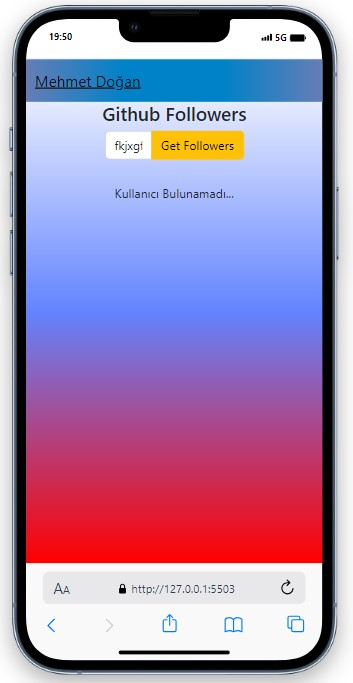
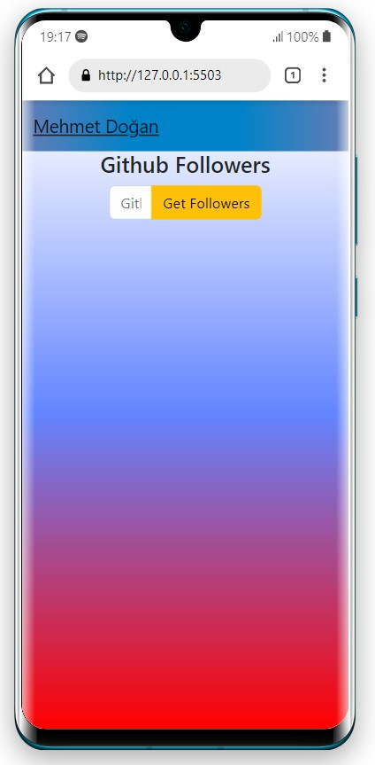
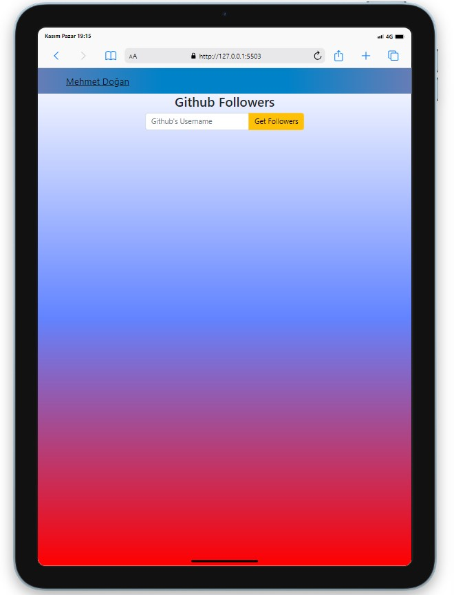
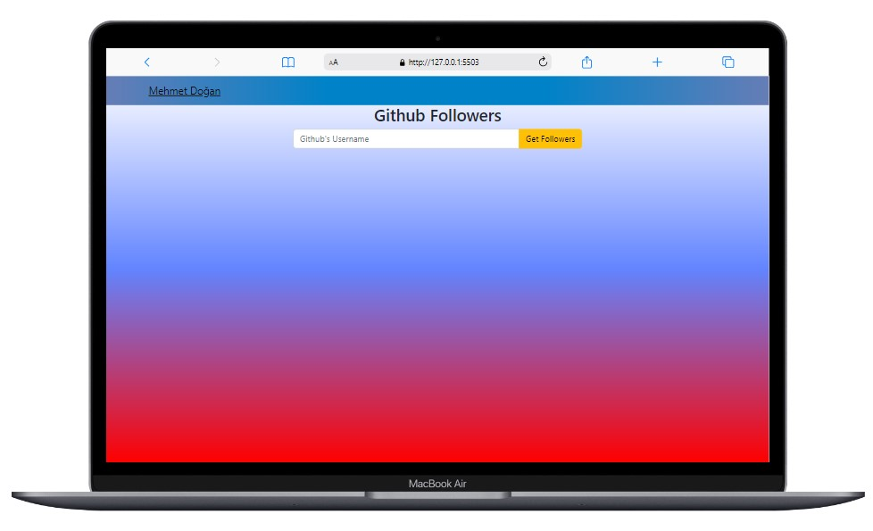

<!-- PROJECT LOGO -->
 

  

  <h3 align="center">Followers App</h3>

  

    With this application, you can easily find out the followers of users on github.
     
    <a href="https://flowers-ap.vercel.app/"><strong>Live »</strong></a>
     
  

<!-- TABLE OF CONTENTS -->

  
Contents of project

  <ol>
    <li>
      <a href="#about-the-project">About The Project</a>
      <ul>
        <li><a href="#built-with">Built With</a></li>
      </ul>
    </li>
    <li><a href="#usage">Usage</a></li>
  </ol>

<!-- ABOUT THE PROJECT -->
## About The Project

 
 
This project is designed to find followers of Github users. Initially, there is only an input field and a button on the screen where data is entered. Find the followers of the user you want by typing the name here. With the arrival of followers, a second input field appears, where you can type and find whatever you want among the followers.   

* In case of incorrect entries, the user is warned with a warning.
* If the user you are looking for is not available, the message "user not found" will appear.

(<a href="#responsive">Go Responsive Designs</a>)

(<a href="#readme-top">back to top</a>)

### Built With

* [][Bootstrap-url]

## Usage
Just enter the user you want in the input field and the codes will do the rest.😎  
## Responsive Designs 📲💻
<!-- Responsive Designs -->

  <!-- First Row -->
  

    
    
  

  
  <!-- Second Row -->
  

    
    
  

(<a href="#readme-top">back to top</a>)

[Bootstrap-url]: https://getbootstrap.com